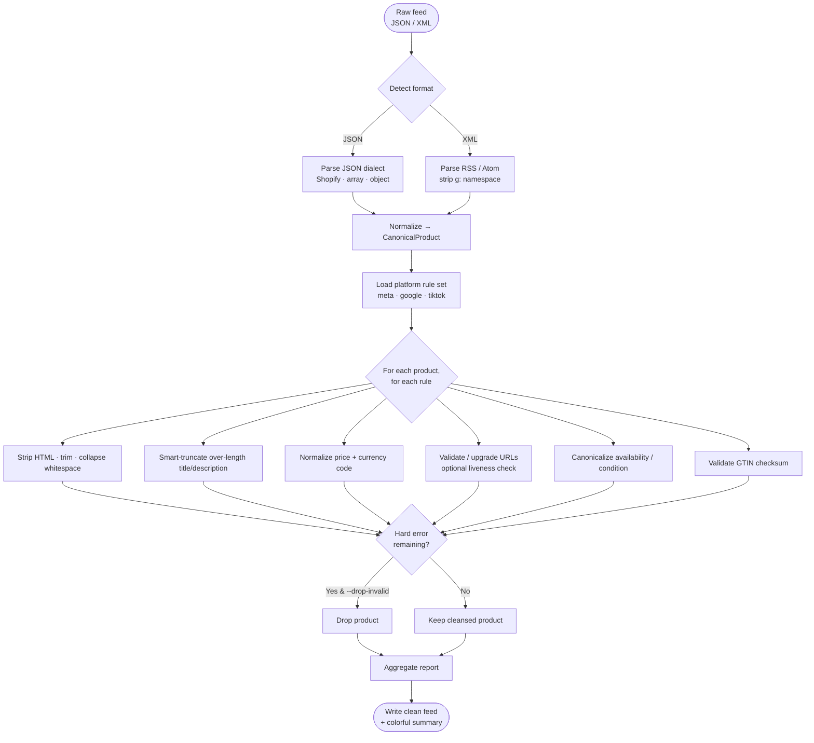

<div align="center">

# 🧹 FeedLint

### Validate & auto-cleanse your e-commerce product feeds before they ever reach an ad platform.

**One CLI. Three destinations.** Lint and auto-fix product feeds against the **2026** specifications of
**Meta Catalog**, **Google Merchant Center**, and **TikTok Catalog** — in about ten seconds.

[](https://www.npmjs.com/package/feedlint)
[](#-license)
[](https://nodejs.org)
[](https://www.typescriptlang.org)
[](#-contributing)

</div>

---

## Why feed hygiene is the cheapest ROAS lever you're ignoring

Every dollar of paid-social and paid-search performance ultimately rests on **one unglamorous artifact: your product feed.** Yet feeds are routinely exported straight out of Shopify, WooCommerce, or Magento and pushed to ad platforms **raw** — full of HTML soup in titles, missing currency codes, dead image URLs, and over-length descriptions.

Here is the brutal economics of a dirty feed:

- **Disapprovals shrink your addressable catalog.** A product that fails validation is silently dropped from your catalog. Fewer eligible items → smaller audiences → less efficient delivery. You are paying the same CPMs to reach a fraction of the demand you could.
- **Truncation kills relevance signals.** When a title exceeds the platform limit, the platform cuts it *mid-word* at an arbitrary byte. Your most important keyword often lands on the cutting-room floor, tanking relevance and quality scores — the exact inputs the auction uses to lower your CPC.
- **HTML in descriptions degrades quality.** `<p>`, `<span>`, and stray `&nbsp;` entities leak into the rendered ad copy, look unprofessional, and dilute the machine-readable signal the ranking models depend on.
- **Broken image links waste spend.** An image that 404s means an ad unit that can't render — impressions burned, clicks lost, and a catalog item that quietly stops serving.
- **Currency ambiguity breaks ROAS attribution.** A bare `"19.99"` with no currency code is interpreted inconsistently, corrupting value-based bidding and the ROAS numbers you optimize against.

**The fix is not glamorous, but it compounds.** A clean feed means more eligible products, higher relevance scores, lower effective CPCs, and trustworthy conversion values. FeedLint automates that hygiene so you stop leaking budget on problems a script should have caught.

> **TL;DR** — Dirty feeds quietly tax every campaign you run. FeedLint is the lint-and-fix step that belongs in your deploy pipeline, right next to your tests.

---

## What FeedLint does

FeedLint reads a product feed (**JSON or XML**), runs it through a platform-specific rule engine, and writes a **cleansed, ready-to-upload feed** — while telling you exactly what it scanned and what it repaired.

It does not just *complain*. It **fixes**:

| Problem in your raw feed | What FeedLint does automatically |
| --- | --- |
| Title longer than the platform limit | **Smart-truncates** at a word boundary with an ellipsis — never mid-word |
| HTML / entities in title or description | **Strips tags**, decodes entities, collapses whitespace |
| Price like `"$1,299"` or `"19,99"` | **Normalizes** to `"1299.00 USD"` with correct decimals & currency |
| Missing currency code | **Backfills** the platform's default ISO-4217 currency |
| `http://` image / landing URLs | **Upgrades** to `https://` |
| Dead image URL (`--check-images`) | **Flags** it as an error so it never ships |
| `availability: "InStock"` / `"sold out"` | **Maps** to the canonical `in stock` / `out of stock` token |
| `condition: "Brand New"` | **Maps** to canonical `new` / `refurbished` / `used` |
| GTIN with dashes / bad checksum | **Normalizes** separators, **warns** on invalid check digits |
| Missing required fields | **Reports** them per-product (and can **drop** them with `--drop-invalid`) |

Supported input dialects out of the box:

- **Shopify** `products.json` (nested `variants[]` + `images[]` are flattened automatically)
- **Generic JSON** — a bare array, or `{ "products": [...] }` / `{ "items": [...] }` / `{ "data": [...] }`
- **Google RSS XML** (`<rss><channel><item>` with the `g:` namespace) and Atom `<feed><entry>`
- **WooCommerce / Magento** REST exports (via the generic JSON shapes above)

---

## ⏱️ 10-second quick start

```bash
# 1. Install (global) — or use npx with no install at all
npm install -g feedlint

# 2. Lint & auto-cleanse a Shopify export for Meta
feedlint --input shopify_products.json --platform meta

# …or with zero install:
npx feedlint -i shopify_products.json -p meta
```

That's it. FeedLint writes `shopify_products.feedlint.json` next to your input and prints a color-coded summary of everything it scanned and fixed.

---

## Cleansing flow



---

## Usage

```text
feedlint --input <path> --platform <meta|google|tiktok> [options]
```

| Option | Description | Default |
| --- | --- | --- |
| `-i, --input <path>` | Source feed file (`.json` or `.xml`). **Required.** | — |
| `-p, --platform <name>` | Target platform: `meta`, `google`, or `tiktok`. **Required.** | — |
| `-o, --output <path>` | Where to write the cleansed feed. | `<input>.feedlint.<format>` |
| `-f, --format <type>` | Output serialization: `json` or `xml`. | `json` |
| `--no-autofix` | Report problems but leave the data untouched (dry run). | autofix on |
| `--check-images` | Perform a live `HEAD`/ranged-`GET` reachability check on every image URL. | off |
| `--concurrency <n>` | Max simultaneous image probes when `--check-images` is set (1–64). Unique URLs are deduped and probed through a bounded worker pool. | `8` |
| `--drop-invalid` | Exclude products that still have unresolved errors from the output. | off |
| `--no-details` | Suppress the per-product findings breakdown. | details on |
| `--max-detail <n>` | Max number of products shown in the findings breakdown. | `25` |
| `--explain` | Print the selected platform's 2026 spec and exit (no processing). | — |
| `-v, --version` | Print the FeedLint version. | — |
| `-h, --help` | Show help. | — |

### Examples

```bash
# Validate a Google feed and write cleansed XML, checking that images resolve
feedlint -i feed.xml -p google -o clean_feed.xml -f xml --check-images

# Large catalog: probe images 24-at-a-time through the worker pool
feedlint -i big_feed.json -p meta --check-images --concurrency 24

# Dry run: see what WOULD change for TikTok without writing fixes
feedlint -i feed.json -p tiktok --no-autofix

# Ship only fully-valid products to Meta, dropping the rest
feedlint -i shopify_products.json -p meta --drop-invalid

# Just show me Google's 2026 limits
feedlint -p google --explain
```

### Exit codes

| Code | Meaning |
| --- | --- |
| `0` | Success — clean feed written, no unresolved errors. |
| `1` | Completed, but unresolved errors remain in the output feed. |
| `2` | Fatal error — bad input, parse failure, write failure, or bad arguments. |

These codes make FeedLint **CI-friendly**: drop it into a pipeline and fail the build when a feed regresses.

---

## Platform rule reference (2026)

| Rule | Meta Catalog | Google Merchant Center | TikTok Catalog |
| --- | --- | --- | --- |
| Title max length | 200 | 150 | 100 |
| Description max length | 9999 | 5000 | 10000 |
| Default currency | USD | USD | USD |
| `brand` required | ✅ | ✅ | optional |
| Allowed `availability` | in stock · out of stock · preorder · available for order · discontinued | in stock · out of stock · preorder · backorder | in stock · out of stock · preorder · available for order |
| Allowed `condition` | new · refurbished · used | new · refurbished · used | new · refurbished · used |

> Run `feedlint --platform <name> --explain` to print the live spec FeedLint enforces.

---

## Programmatic use

FeedLint's engine is a plain async function — drop it into your own Node tooling:

```ts
import { runEngine } from "feedlint/dist/engine.js";

const report = await runEngine({
  inputPath: "shopify_products.json",
  outputPath: "clean.json",
  platform: "meta",
  autofix: true,
  checkImages: false,
  dropInvalid: false,
  format: "json",
});

console.log(`Scanned ${report.totalScanned}, auto-fixed ${report.totalFixed}.`);
```

---

## Development

```bash
git clone https://github.com/NagaYu/feedlint.git
cd feedlint
npm install

npm run typecheck   # strict tsc, no emit
npm run build       # bundle to dist/ with tsup
npm run dev         # rebuild on change
node dist/index.js -i sample.json -p meta
```

The codebase is intentionally small and strict:

| File | Responsibility |
| --- | --- |
| `src/types.ts` | All shared types, the canonical product shape, and the typed error class. |
| `src/rules.ts` | Cleansing primitives + the declarative per-platform rule sets. |
| `src/engine.ts` | Parse → normalize → apply rules → serialize. |
| `src/index.ts` | The commander CLI + colorette summary renderer. |

---

## Contributing

PRs and issues are welcome. Good first contributions:

- Add a new input dialect to `normalizeProduct` in `src/engine.ts`.
- Tighten a platform spec in `PLATFORM_SPECS` (`src/rules.ts`) as the official docs evolve.
- Add a new cleansing rule via the `buildRules` assembler.

Please keep `npm run typecheck` green — the project compiles under `strict: true` with `exactOptionalPropertyTypes`.

---

## 📄 License

MIT © FeedLint Contributors

```text
Permission is hereby granted, free of charge, to any person obtaining a copy
of this software and associated documentation files (the "Software"), to deal
in the Software without restriction, including without limitation the rights
to use, copy, modify, merge, publish, distribute, sublicense, and/or sell
copies of the Software, and to permit persons to whom the Software is
furnished to do so, subject to the following conditions:

The above copyright notice and this permission notice shall be included in all
copies or substantial portions of the Software.

THE SOFTWARE IS PROVIDED "AS IS", WITHOUT WARRANTY OF ANY KIND, EXPRESS OR
IMPLIED, INCLUDING BUT NOT LIMITED TO THE WARRANTIES OF MERCHANTABILITY,
FITNESS FOR A PARTICULAR PURPOSE AND NONINFRINGEMENT. IN NO EVENT SHALL THE
AUTHORS OR COPYRIGHT HOLDERS BE LIABLE FOR ANY CLAIM, DAMAGES OR OTHER
LIABILITY, WHETHER IN AN ACTION OF CONTRACT, TORT OR OTHERWISE, ARISING FROM,
OUT OF OR IN CONNECTION WITH THE SOFTWARE OR THE USE OR OTHER DEALINGS IN THE
SOFTWARE.
```

<div align="center">

**If FeedLint saved you from a feed disapproval, drop a ⭐ — it helps other growth engineers find it.**

</div>
